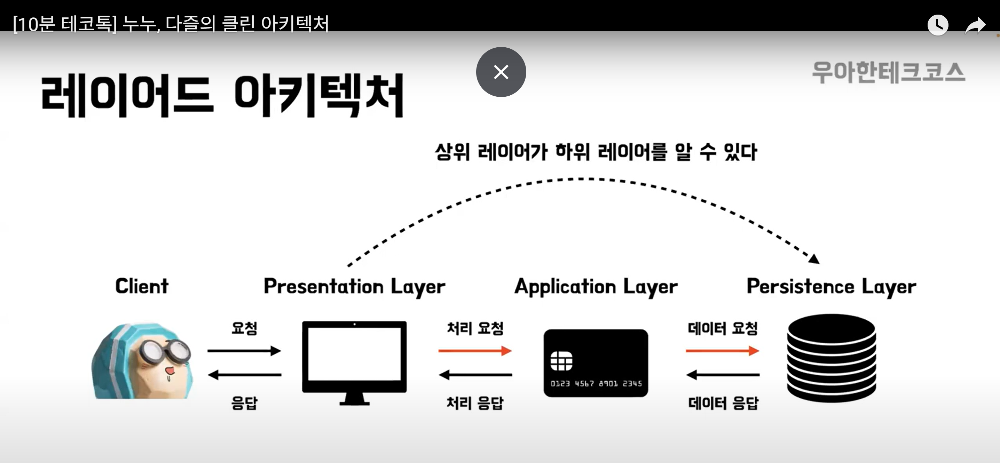
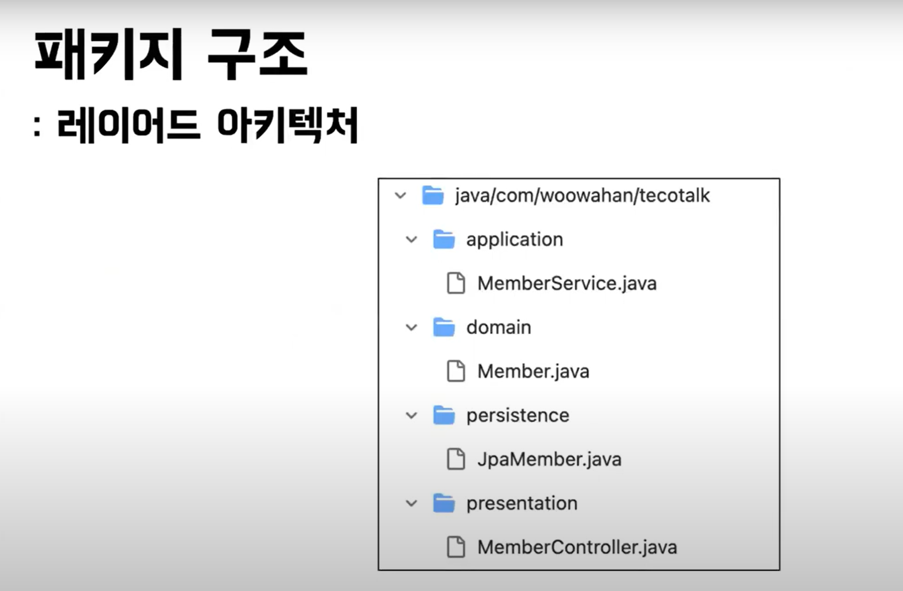
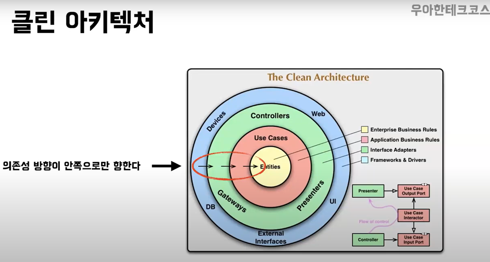
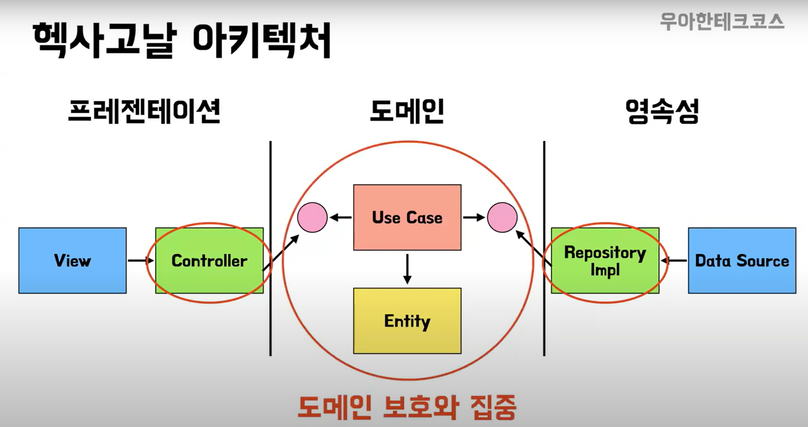
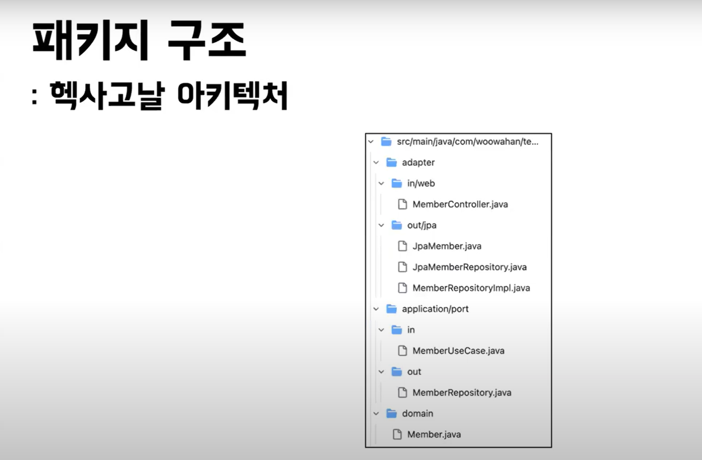

# 아키텍쳐

## 시작
내가 생각하는 개발이란 기능보다 아키텍쳐가 중요하다고 생각한다.
기능은 ai를 이용하여 만들 수 있지만, 장기적으로 봤을 때 개발은 유지보수를 더 많이 한다.
따라서, 아키텍쳐에 대해서 배워보자.

## 아키텍쳐란 무엇인가?
서비스에 맞는 전체적인 구성과 설계를 하는 것을 말한다.

## 종류
- 레이어드 아키텍쳐
- 클린 아키텍쳐
- 헥사고날 아키텍쳐

## 레이어드 아키텍쳐
- 관심사가 같은 것들을 묶어서 설계하는 방식
- Client -> Presentation -> Application -> Persistence 
- 대표적인 방식에는 크게 Presentation , domain, dataSource로 구성되어진다. (설계는 정해져 있는 게 아닙니다. 여러 계층으로 나눌 수 도 있어요)
  표현 계층(Presentation Layer) 은 사용자 입력을 처리하기 위해 존재합니다.
  도메인 계층(Domain Layer) 은 비즈니스와 관련된 로직을 수행하기 위해 존재합니다.
  데이터 소스 계층(Data Source Layer) 은 데이터베이스 접근 및 데이터 조작과 관련된 작업을 수행하기 위해 존재합니다.

tip
- persistence layer (data access layer) 
  - 데이터 crud와 관련된 모든 로직을 처리하는 코드상의 영역을 나타냅니다.

### 레이어드 특징
- 계층화로 인한 분리된 책임
- 편의에 따라 여러 계층을 추가 가능하다.
- Presentation, application, domain, persistence
- 구조가 쉽고 단순하고 익숙하다
- 데이터베이스 주도 설계가 될 수 있다.
- 상위 레이어가 하위 레이어를 가지고 있다.
  - 하위 레이어의 변경이 상위 레이어에 영향을 줍니다.
  - 이것이 바로 의존성이 생겼다고 할 수 있습니다.
  - 따라서, 코드 변경이 어렵다.
  

### 레이어드 아키텍쳐의 문제점
- 의존성 떄문에 하위 계층의 변경이 프로젝트 전체에 영향을 줍니다.
- 해결법
   - 프로젝트 전체가 db에 의존하는 대신, 도메인에 의존하게 바꿉니다.
   - 의존성 방향이 안쪽으로만 흐른다 = 클린 아키텍쳐 

## 클린 아키텍쳐

- 의존성 역전을 통해 도메인이 중심이 되는 설계 방법
-의존성 역전 원칙을 통해 시스템의 각 부분이 서로에게 미치는 영향을 최소화하는 소프트웨어 설계 철학입니다.
- 핵심은 의존성 규칙, 즉 모든 의존성은 외부에서 내부로만 향해야 한다는 것입니다. 
- 이를 통해 비즈니스 로직을 외부 기술(UI, DB, 프레임워크)의 변화로부터 보호하여 테스트와 유지보수가 용이한 시스템을 만드는 것을 목표로 합니다.

### 클린 아키텍쳐 구조
- 크게 두가지 계층으로로 나누는데, 엔티티와 유즈 케이스인 내부와 외부로 분리하는 게 핵심입니다.
- 총 4가지로 구성되어 있다.
  - 엔티티 레이어 (enterprise)
    - 핵심적인 엔티티나 도메인 객체를 의미
    - 비지니스 로직이나 규칙을 나타내며 외부 요소에 대한 어떠한 의존성도 x
  - 유스케이스 레이어 (application)
    - 비지니스 로직을 포함하고, 레파지토리에서 데이터를 받아옵니다
    - 엔티티를 사용하여 실제 비즈니스 흐름을 구현하며, 외부 통신이 필요할 경우 포트(Port)라는 인터페이스를 정의합니다."
  - 인터페이스 어댑터 (interface adapters)
    - 데이터를 어플리케이션에서 사용하는 형태로 변환하거나, 내부에서 사용하는 데이터를 외부에 적합한 형태로 변환
    - controllers
    - 예를 들어, 웹 요청을 유스케이스가 이해할 수 있는 데이터로 변환하는 컨트롤러, DB 데이터를 유스케이스의 포트(인터페이스)에 맞게 구현한 리포지토리(어댑터) 등이 여기에 속합니다."
  - 인프라스트럭쳐 레이어
    - 외부 요소, 특정 프레임워크나 기술에 의존하는 부분을 의미한다.
  
### 질문
1. controller는 inputport를 사용해서 내부로 가는거고 서비스에서 db와의 외부작업을 연결하기위해 outputport를 사용한다는거임?
- 네, 맞습니다. 그 흐름이 정확히 클린 아키텍처의 의존성 규칙을 지키는 방법입니다.

Controller → Input Port → UseCase: 외부(Controller)에서 내부(UseCase)로의 요청 흐름.

UseCase → Output Port → Adapter(DB): 내부(UseCase)에서 외부(DB)로의 데이터 요청 흐름

2. inputport는 인터페이스야? 아니면 클래스야?
Input Port는 인터페이스(interface)입니다.
마찬가지로 Output Port도 인터페이스(interface)입니다.
클린 아키텍처에서 '포트(Port)' 라는 용어는 항상 인터페이스를 의미한다고 생각하시면 쉽습니다.

- Input Port (입력 포트)
  역할: 유스케이스(서비스)가 "어떤 기능을 제공하는지"를 정의하는 규칙(메뉴판).
  구현: 유스케이스 구현체(Interactor)가 이 인터페이스를 implements 합니다.
  사용: 컨트롤러가 이 인터페이스에 의존하여 유스케이스를 호출합니다.

- Output Port (출력 포트)
  역할: 유스케이스가 "외부로부터 어떤 데이터나 기능이 필요한지"를 정의하는 요구사항.
  구현: 외부 어댑터(예: DB Repository)가 이 인터페이스를 implements 합니다.
  사용: 유스케이스가 이 인터페이스를 통해 외부 어댑터의 기능을 호출합니다.
  결론적으로, **인터페이스(포트)**를 통해 구체적인 클래스 간의 직접적인 의존을 끊어내는 것이 의존성 역전 원칙의 핵심이자 클린 아키텍처의 정수입니다.

3. 클린 아키텍처의 의존성 역전
- UseCase ← Repository (Output Port): 이 부분이 핵심입니다.
- 유스케이스는 "나는 이런 데이터가 필요해"라는 아웃풋 포트(Output Port) 인터페이스를 정의만 합니다.
- 리포지토리(어댑터)는 유스케이스 계층에 정의된 아웃풋 포트 인터페이스를 구현(implements) 합니다.
- 결과적으로 의존성의 방향이 UseCase → Repository가 아니라 **Repository → UseCase**로 역전됩니다.

네, 정확하게 이해하고 계십니다. 질문하신 두 가지 모두 맞습니다. 그 부분을 명확히 구분해서 설명해 드릴게요.

1. Controller - Service - ServiceImpl 구조
내가 예전에는 레이어드 아키텍쳐로 controller - service - serviceimpl 로 나눴는데 이것도 레어어드 아키텍쳐라고 생각하는데 맞는지 알려주고
네, 맞습니다. 그것은 전형적인 레이어드 아키텍처(Layered Architecture)의 좋은 구현 예시입니다.
Controller (Presentation Layer): 사용자의 요청을 받는 표현 계층
Service / ServiceImpl (Business Layer): 비즈니스 로직을 처리하는 서비스 계층
(ServiceImpl이 호출하는) Repository (Persistence Layer): 데이터를 처리하는 영속 계층
이렇게 각자의 역할에 따라 계층을 나누는 것 자체가 레이어드 아키텍처의 핵심입니다.

2. 의존성 역전 원칙 (DIP) 적용 여부
   이것도 service라는 인터페이스를 만들고 컨트롤러는 인터페이스에 의존하고있는데 ?? 이것도 의존의 역전이라고하는거아님??

매우 좋은 질문입니다. 그 부분에서 많은 개발자들이 혼란을 겪습니다.
결론부터 말하면, Controller가 Service 인터페이스를 의존하는 것은 의존성 역전 원칙(DIP)의 일부를 적용한 것이 맞습니다. 구체적인 구현체인 ServiceImpl이 아닌, 추상화된 인터페이스 Service에 의존했기 때문입니다.
클린 아키텍처와의 결정적인 차이점
하지만 클린 아키텍처가 강조하는 의존성 역전은 거기서 한 걸음 더 나아갑니다. 가장 중요한 경계인 서비스 계층과 데이터 계층 사이의 의존성을 역전시키는 데 초점을 맞춥니다.
전통적인 레이어드 아키텍처 (사용자 방식)
의존성 흐름: Controller → Service → Repository
문제: 비즈니스 로직을 담고 있는 서비스(ServiceImpl)가 데이터 기술인 리포지토리에 직접 의존합니다. 즉, 내부 로직이 외부 기술에 종속됩니다.
클린 아키텍처
의존성 흐름: Controller → UseCase ← Repository
해결: 서비스(UseCase)가 리포지토리를 전혀 알지 못합니다. 대신 서비스는 "나는 이런 기능이 필요해"라는 **아웃풋 포트(인터페이스)**를 정의하고, 리포지토리(어댑터)가 이 포트를 구현하도록 만듭니다. 이로써 Service → Repository 관계가 완전히 역전됩니다.

### 클린 아키텍쳐 특징
- 핵심 규칙을 담고 있는 도메인이 중심
- 도메인이 세부 사항(db, 입출력 장치, 웹 시스템, 프레임워크)에 의존하지 않는다.

## 헥사고날 아키텍쳐

클린 아키텍쳐를 적용하는 아키텍쳐로, 외부 요소와 핵심 비지니스 로직이 통신할 때
port를 통해서 통신해야 한다는 것입니다.

### 헥사고날 아키텍쳐 특징
- 큰 비지니스 가치를 가지고 있는 도메인 모델에 큰 관심
- 포트와 어뎁터를 구성하고 관리하는 데 복잡성이 따른다.
- 도메인에 라이브러리를 직접 활용하기 어렵다.

### 구조
- 도메인 모델 : 애플리케이션의 핵심 기능, 비지니스 로직을 규칙을 캡슐화합니다.
- 포트 : 애플리케이션의 도메인 모델과 외부의 통신 인터페이스를 정의
  - 입력 포트 : 유스케이스를 호출하는 포트, 동작을 유발하는 외부 요청을 처리합니다.
  - 출력 포트 : 유스케이스로 부터 호출되서 동작의 결과를 외부로 전달합니다.
- 어뎁터 : 외부 요소를 직접 다루는 곳입니다.
  - 외부와의 구현을 한다.

### 강의에서의 구조
- 다비 비에이라의 '헥사고날 아키텍처 설계와 구현'이라는 서적의 모델
- 헥사고널 아키텍처 모델을 3개의 헥사고널(도메인,애플리케이션,프레임워크)로 나누고 각각의 의미를 부여했는데 애플리케이션 헥사곤의 요소를 유스케이스-인풋포트-아웃풋포트로 구현하고 유스케이스를 인터페이스로 정의하고 인풋포트를 구현체로 활용했습니다. 
- 다비 비에이라의 방식은 유스케이스를 단순한 구현체의 역할 보다는 
- 이바 야콘슨의 '유스케이스 시나리오, '유스케이스 명세' 의 개념으로 파악한 것으로 애플리케이션 헥사곤이 갖는 의미 즉 '시스템이 정의 한 목표를 달성하기 위해 함께 동작하는 일련의 행위의 집합'를 구현한다. 를 강조하기 위해 유스케이스로 이러한 애플리케이션이 제공할 기능(일련의 행위 집합으로 시나리오 형태임)를 먼저 인터페이스로 정의한 것이라 생각합니다. 
- 즉 간단히 말하면, 애플리케이션 헥사곤에서 가장 중요한 것은 도메인 헥사곤이 가진 비지니스 여러 개념을 복합적으로 활용하여 비지니스 목적에 맞는 시나리오를 구현하는 것인데, 그걸 명확히 표현한 방식이 이바 야콥슨 '유스케이스 명세'라는 방식이고, 이것을 강조한 구조라고 생각하면 됩니다.

- 나의 구조
  - application (inputPort, outputPort, useCase)
  - domain  (entity)
  - framework (inAdapter(web), outAdapter(jpaRepositoryAdapter))

### 이해해보기
- controller는 포트만 접근 할 수 있다.
- reposiotry에 있는 port로 부터 유스케이스의 결과를 저장한다.

### 헥사고날 아키텍쳐로 바꿔보기
1. 서비스와 레포지토리의 메서드를 인터페이스로 분리한다.
   - Service ->  useCase, service , repository
   - 서비스의 메서드를 유스케이스로 만든다.
   -  레파지토리를 인터페이스로 만든다.
2. 도메인 분리한다.
- jpa의 member를 service에서 의존하지 않고, domain을 서비스에 의존시킨다.
  -> 패키지간 양방향 의존 관계를 끊어 낼 수 있다.
